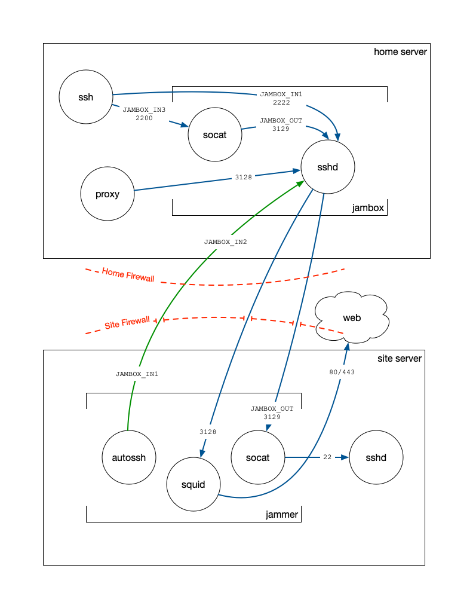

# Jambox

Jambox is a set of docker containers that makes it easy to setup your own ssh-based vpn.

## Jambox

The jambox sites on your own private network, so you will need to
configure your router to port forward to the ssh daemon inside the
jambox. Jamboxes are more commonly known as jumpboxes.

Strictly speaking in this setup you don't need to run the jambox
container, all you really need is an ssh server on your network.

## Jammer

The Jammer is runs behind a firewall that you cannot control. It uses
a combination of autossh and socat to setup a tunnel from your jambox
all the way back to the docker host (not the container) ssh daemon.

## Architecture

The following diagram spells this out. Note the end result is the data
flow from ssh on the "home server" to sshd on the "site server".

## Setup

Generate a new jammer-specific ssh key for the jammer, you don't want
to use your own key for this do you?

	$ ssh-keygen -t rsa -f ~/.ssh/jammer_rsa -N ''

Create an `env` file in this directory to describe the jambox host and
account. This files gets shared between both containers.

	JAMBOX_USER=<username>
	JAMBOX_HOST=<hostname>
	JAMBOX_SSH_PORT=22
	
See the docker-compose.yaml files for other environment variables that have
predefined defaults.

## Starting

### Jambox

#### Build

	cd jambox
	docker-compose build
	
#### Start

	cd jambox
	docker-compose up -d
	
### Jammer

#### Setup SSH

	source env
	ssh-copy-id -i ~/.ssh/jammer_rsa -p$JAMBOX_SSH_PORT $JAMBOX_USER@$JAMBOX_HOST

#### Build

	cd jammer
	docker-compose build

#### Start

	cd jammer
	docker-compose up -d

## Using
	
From you $JAMBOX_HOST (default is 2222) you can ssh to your "site
server" behind the firewall.

	ssh -p $JAMBOX_PORT <username>@localhost

